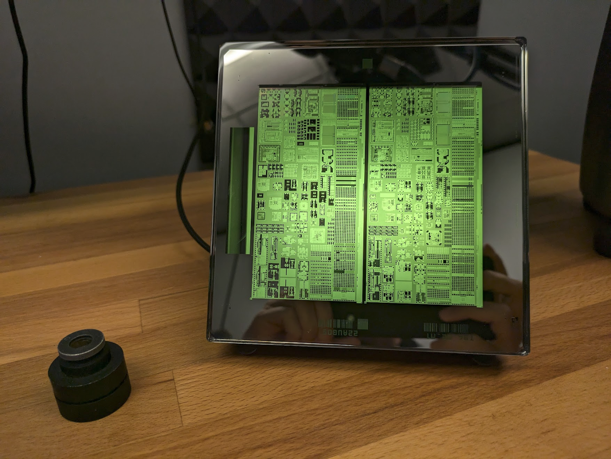
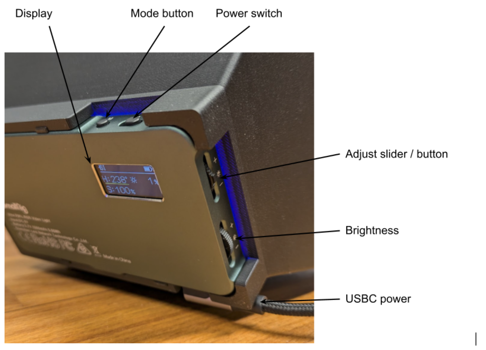
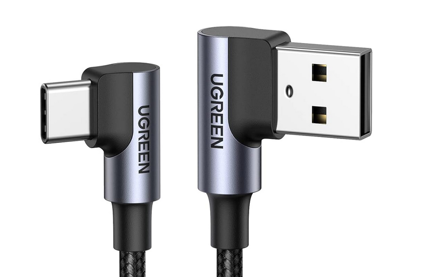

### Litho Light

Display your 150mm photolithography masks in style with the Litho Light! [Watch the video here](https://www.youtube.com/watch?v=PbzwKpNnM3Q).

### Instructions

* Plug in the right angle USBC cable. Turn the power on with the power switch.
* Set the brightness to the lowest level with the brightness control.
* Press the mode button to cycle through the light modes:
    * RGB colours (recommended),
    * Effects,
    * White.
* Adjust the colour / saturation with by pressing the adjust slider up or down.
* In RGB colour mode, to switch between colour and saturation press the adjust slider in.

### Parts

* The light is a [SmallRig P96L](https://www.smallrig.com/global/SmallRig-Vibe-P96L-RGB-Video-Light-3489B.html). 
* The provided cable is a [UGREEN right angle USB A to USB C](https://www.amazon.es/gp/product/B07PDKKS88/ref=ppx_yo_dt_b_asin_title_o00_s00?ie=UTF8&th=1). If using a different cable, check it has clearance to fit.
* The housing is 3D printed from this [CAD](https://cad.onshape.com/documents/ff92790bfef612a72b209e99/w/bc7fef391c16d03a85d640ae/e/9dec6515afcd61895a9b9336?renderMode=0&uiState=669f760565e493510a9beafd).
    * The [main housing STL](stl/housing.stl) (30% infill, black PLA)
    * The [diffuser bezel STL](stl/bezel.stl) (15% infill, black PLA)
* The diffusor is 2 sheets of tracing paper held in place with the bezel.

### License & Attribution

* Thanks to [Adam Zeloof](https://adam.zeloof.xyz/) for assistance with the CAD.
* Thanks to [IHP](https://www.ihp-microelectronics.com/) for the mask. Watch this to [find out more about how masks are used](https://www.youtube.com/watch?v=aBDJQ9NYTEU) to create microchips.
* This project is licensed under the [Creative Commons Attribution Sharealike 4.0](https://creativecommons.org/licenses/by-sa/4.0/)
* [Photo gallery](https://photos.app.goo.gl/EAQCseDm1kts5c8Q8)
